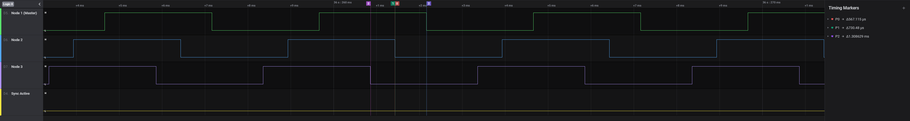
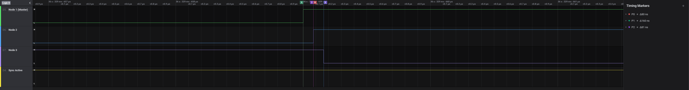
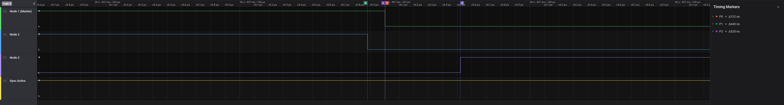

## Time Synchronization over Bluetooth Low Energy - ECE M202A Final Project

### Project Goals

Bluetooth Low Energy (BLE) is a popular wireless technology used in many consumer devices. It provides a low bandwidth, low power solution that allows devices to communicate with each other wirelessly and cheaply. Due to this, it has gained massive popularity among enthusiasts, as well as consumers. Time synchronization is the notion of different nodes in a system being aligned to the same reference of time. This allows for systems to provide timestamps for events that they see and correlating those timestamps across different nodes in an accurate way. Wirelessly time synchronizing nodes currently requires special hardware like 2.4GHz radios. From a consumer and enthusiast point of view, these technologies for time synchronization are not feasable. In order to provide a method for synchronizing time over BLE, we analyze software solutions. This solution would allow many BLE nodes to be time synchronized to each other.

### Approach

Nordic microcontrollers use a wireless stack called SoftDevice. SoftDevice is provided as a precompiled binary that is flashed onto the microcontroller's memory and provides an API for interacting with wireless radios like BLE. One of the APIs offered is called the Radio Timeslot API (timeslot API). The timeslot API provides uninterrupted access to the radio hardware for anywhere between 100us to 128 seconds. By using the timeslot API, we can precisely know the time at which a packet was transmitted by the BLE radio.

Nordic microcontrollers also provide another useful feature called Programmable Peripheral Interconnect (PPI). PPI allows peripherals to autonomously interact with each other to complete certain tasks. By using PPI, the radio peripherals could interact with other peripherals, such as the timer peripheral. This allows for fast response to packet reception.

By using the timeslot API and PPI together, both master and slave devices would have precise timing information about when synchronization packets were transmitted and received.

### Implementation and Analysis

In the implementation of the time synchronization, there are a few things we have to look at. The first is that the code uses a 16MHz timer as the basis for the time synchronization. Every node in the system will be running a 16MHz timer. One of the nodes will be the timing master. The timing master will never adjust it's own timer. At a programmable rate, the timing master will send out a packet that contains its own counter value for the 16MHz timer. Timing slaves will receive this packet and compare the counter value to its own timer counter value. The timing slaves can then offset their timer to sync up with the timing master.

There are two challenges that have to be addressed. The first challenge is sending out an accurate timer counter value. Generally, Bluetooth has variability around when a packet is actually sent out over the air which leads to inaccurate timing information. In order to address that, the code uses the Nordic SoftDevice Timeslot API. This API allows a user to reserve some segment of time where they have full control over the radio hardware. This is extremely powerful as it provides the ability to precisely know when a given packet is sent out. In the code, we see that a timer and PPI are used together to precisely match when the radio is ready to send a packet before initiating the send. By doing this, the counter value used for the time synchronization can be read and stored at a consistent offset from the actual transmit of the packet. The second challenge is around how the receiver receives the packet and updates its own timer value. The packet being received is triggered through hardware triggers rather than relying on the CPU to intiate some trigger as that can add unwanted delays and variability. Once the packet is received, the timer has to be updated with the offset between its timer value and the received timer value. Another important thing to note is that the code utilizes a TX_CHAIN_DELAY. TX_CHAIN_DELAY is essentially a magic number obtained through testing. This number is meant to represent the typical amount of time that occurs between the packet being sent and the receiver receiving the packet and being notified in software that a packet has been received. A disadvantage of this number is that it can vary based on things like manufacturing differences in the hardware, cache misses, distance between the nodes, and higher priority interrupts. This is generally okay unless a very tight timing synchronization is required.

In order to test this code, we used a setup that uses 3 nRF52 dongles. Each of the dongles has a time sync service that allows for a user to select which dongle should be the timing master (0x1 for master, 0x0 for slave). When a dongle sees that a value of 0x1 has been written to it, it will toggle a GPIO pin then start broadcasting the sync packets at some rate chosen at compile time. For our testing, we chose 10Hz. We hooked up a logic analyzer to another GPIO pin that toggles at every count of the 16MHz timer. In the below capture, we see that the edges are out of sync ranging from 500 microseconds to 1.3ms.

The next capture image is immediately following the first time sync packet being sent out (notice that the Sync Active pin is now high). We see in this capture that the time sync ranges from 80 nanoseconds to 160 nanoseconds.

We also look at how much drift there is between the nodes. In the capture image below, we see that immediately before the next sync occurs, the nodes have drifted apart to as much as 500 to 600 nanoseconds between one of the nodes and the other two. 

This is still sufficient for sub microsecond time synchronization. The rate at which the sync packet is sent can also be increased to keep tighter time synchronization.

### Conclusion and Future Work

### Presentation Slides

### References

* https://devzone.nordicsemi.com/nordic/short-range-guides/b/bluetooth-low-energy/posts/wireless-timer-synchronization-among-nrf5-devices
* https://cps.iisc.ac.in/wp-content/uploads/2017/10/07378439.pdf
* https://dl.acm.org/doi/pdf/10.1145/3123878.3132007
